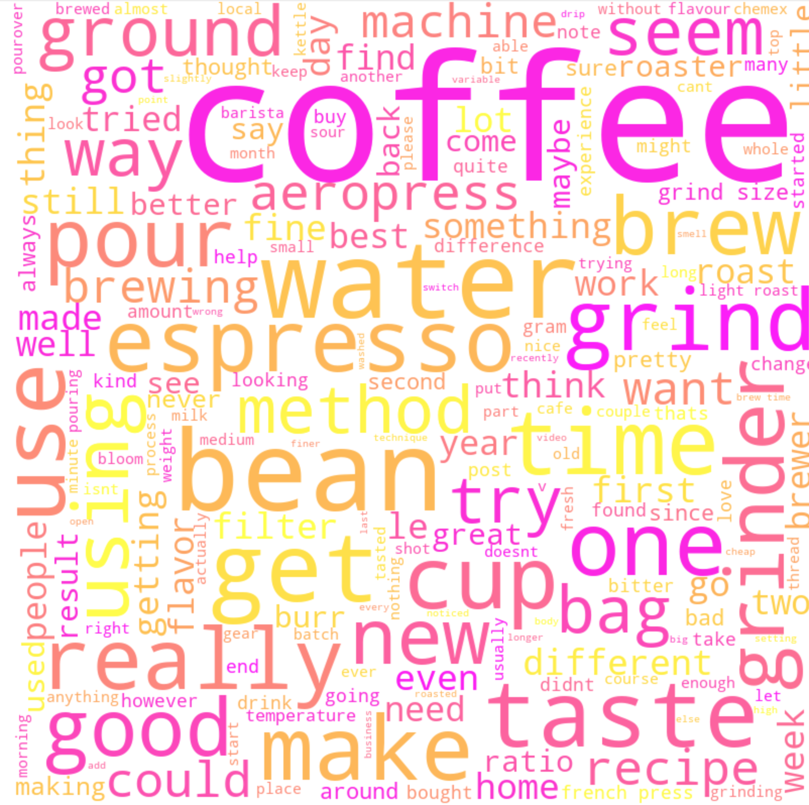
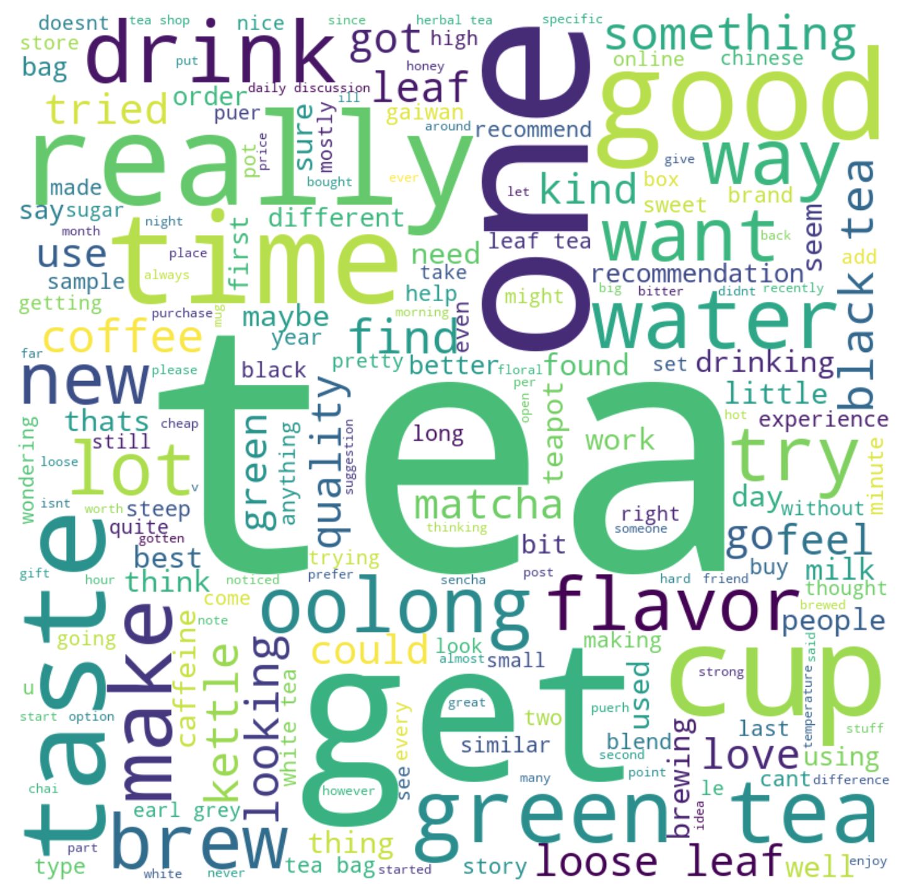
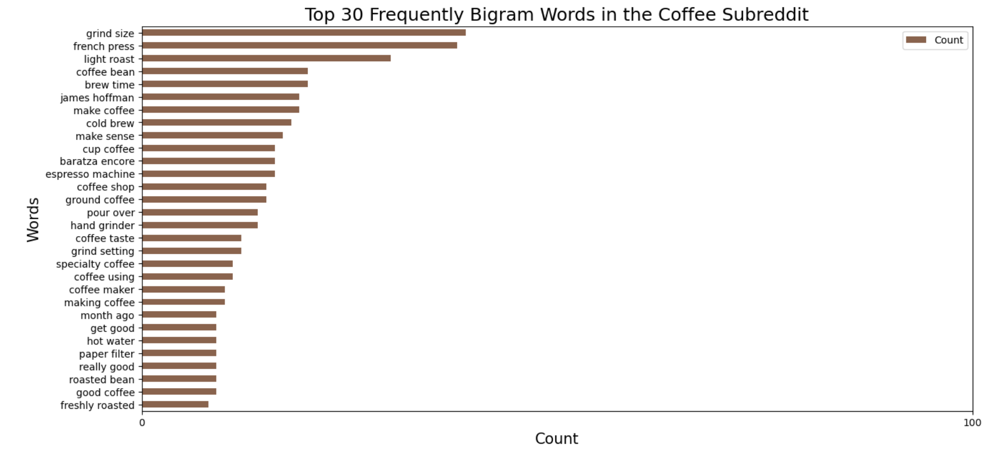
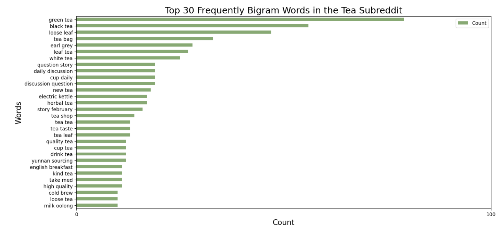

# NLP and Classification: A study on coffee and tea with NLP

## Project Background 

This is the third graded project, as part of the General Assembly Data Science Immersive (Flex) course. 

## Problem Statement

**Aim: To classify words related to Coffee and Tea and knowing what their preferences**

Did you know, that the [coffee market is Singapore is worth over $2mil](https://www.statista.com/outlook/cmo/hot-drinks/coffee/singapore#:~:text=Revenue%20in%20the%20Coffee%20segment,US%2495%2C580.00m%20in%202023)? In fact, Over 2.25 billion cups of coffee are consumed in the world daily. That is an average of 2.5 cups of coffee per person. 

Also, did you also know that the [tea market in Singapore is valued at around $800mil](https://www.statista.com/outlook/cmo/hot-drinks/tea/singapore)? Tea is the second most consumed beverage on Earth after water.

Millions of people enjoy these two beverages everyday across the world. And there are so many suppliers for this case. The problem is, how do we do keep up with the ever changing customer preference?

In this project, I want to use machine learning to understand and analyze future posts related to coffee and tea (topic modelling). This offers opportunities for some business applications, including:
1. Innovating current products in coffee and tea beverages according to trends
2. Target consumers with the right key words via social media marketing
3. Capture the right partners and suppliers in the consumer beverage industry. This can open up different sales and revenue channels.

----

## Structure

```
ga_proj3_dsif9
|__ code
|   |__ 01_Data_Collection.ipynb   
|   |__ 02_Data_Cleaning_Preprocessing_EDA.ipynb    
|   |__ 03_Modeling_and_Evaluation.ipynb  
|__ data
|   |__ coffee.csv
|   |__ tea.csv
|   |__ merged_df.csv
|__ images
|   |__ coffee_top30_bigram.png
|   |__ coffee_wordcloud.png
|   |__ tea_top30_bigram.png
|   |__ tea_wordcloud.png
|   |__ logreg.png
|   |__ decisiontree.png
|   |__ svm.png
|__ slides
|   |__ presentation.pdf
|__ README.md
```
---

## Datasets and Methodology

For this project, I will be using scrapped data from [Reddit](https://www.reddit.com/). I will only collect the title, and its contents (not the comments) for simplicity.

The subreddits used are [r/Coffee](https://www.reddit.com/r/Coffee/) and [r/tea](https://www.reddit.com/r/Tea/).

---

## Techniques and methodology
The project follows the techniques required in a data science project
1. Data Collection
2. Data Preprocessing and Cleaning
3. Exploratory Data Analysis
4. Model selection
5. Model Evaluation

## Data Collection
To conduct my analysis, I collect data by scrapping Subreddit posts on Coffee and Tea. I chose Reddit because it is diverse enough, and can capture consumer preferences and trends across the world. I don’t think it should be limited to Singapore's geography, as this country is often the follower in terms of beverages trends.

I used BeautifulSoup to scrape. Since Reddit is built with an infinity scroll experience, I will use Selenium to enable this. In total, I have collected roughly 1500 rows of data from each subreddit, to allow for outliers and impure data (such as ads posts among the posts).

## Data Cleaning and Preprocessing
I perform a series of actions to preprocess the data before analysis
1. I remove punctuations, numbers, and remove upper case from words
2. I also remove any noise associated to it, for example: stop words, foreign characters
3. Next, I lemmatize the words to reduce the features into a more base form
4. Then, I tokenize the words, before vectorizing it with CountVectorizer and tf-idf vectorizer.
    - for EDA, I use CountVectorizer. This is a straightforward way of determining the most common words within the document.
    - for model prediction, I chose tf-idf as it performs better in terms of accuracy score (tested in the background). One of the reasons that tf-idf performs better is that it can surface rarer words, or diminish the effects of most common words.
6. I then assign them into two categories: coffee as 1, and tea as 0.
    - I assign coffee as 1 because it has a larger market share in Singapore.

A note on data cleaning
* Some of the words scrapped from r/Coffee contains words that has digits alphabets together (for example, 14oz). This is because coffee baristas are quite precise in their measurements and proportions of coffee.
* for r/tea, there are a lot of special characters, due to the different types of tea from places such as China and Korea. This is not a surprise, as China is one of the biggest exporter of tea leaves
* Data cleaning itself is an iterative process. I ran the model, saw that there are still words with digits, and rewrote the code to include more cases. In fact, I included a line to filter out digits in my function to remove stop words
* I decided to keep 'coffee' and 'tea' even though they are giveaway words. This is because the context will be lost if they are removed, especially in the case of tea. 'Green Tea' and 'Green' are two very different words.

Here is a quick glance on the commonly used words in the two documents



## EDA
I use a Bigram to analyse common words among the two documents. I did not remove give-away words such as Tea and Coffee, because this is helpful for the 

At a glance, we can see that there is a huge variety of interests from coffee enthusiasts. This includes:
- Techniques : through bigrams such as 'grind size', 'brew time', etc
- Styles of making coffee : cold brew, french press, pour over
- And tools such as espresso machines, hand grinder
- I have also noticed a name that appears among the top bigram - James Hoffman. He is a renowned barista that has spearheaded the third wave of coffee movement. More importantly, we know that coffee enthusiasts are inspired by experts who are skilled in making good coffee. This looks like an area which needs a complex set of skills.


On the other hand, this is what tea consumers asks about. At a glance, we found that they put more focus on the raw material itself: the leaves.
	- They would ask about loose leaves, and where they can obtain certain tea (such as places, or shops)
	- Also, they asks about different teas such as black tea, green tea, Earl Grey, etc



## Modeling
I will perform training on the data so that we can automate the method to classify future documents and distill the insights. I start with seven classification techniques, and perform cross-validation with tuned hyperparameters using grid search. I group the techniques into four groups:
	- Stacking is an ensemble method that trains multiple base models, and use a meta model to combine the predictions. The models under this group are naïve bayes, logistric regression, SVM, and Decision Tree
	- Bagging is also an ensemble method. It trains multiple instances of the same base model on different subsets of trained data. One example is Random Forest
	- Boosting is the 3rd ensemble method that trains multiple weak models sequentially, then adjusts the weights to improve the model. An example is AdaBoost
    - Lasting, I use a voting methodology. An example is KNN

## Model Evaluation
There are a lot of metrics that we can pick to evaluate the models. I will focus on these for: precision, recall, f1 score, and ROC-AUC score. 
- Precision score can tell the proportion of true coffee posts among the predicted coffee posts. This helps to minimize false positives (classifying tea as coffee)
- Recall score can tell the proportion of true coffee among actual coffee posts. This can minimize false negative (classifying coffee as tea)
- F1 Score is the harmonic mean between precision and recall. For this case, I think we should go for the higher F1 score to represent the effectiveness in identifying the posts correctly
- ROC-AUC Score represents the trade-off between TPR/FPR, and its ability to distinguish both

In consideration of the business problem, I would recommend a model that can classify coffee better than tea. This is to avoid missed opportunities of learning insights about coffee consumers as it is more complex than tea consumers. The model also has to be flexible enough to be fined tune for future.

Here are the result of the models.

| Models | Training Score | Test Score | Accuracy | Precision | Recall | F1 Score | ROC AUC Score |
| :-: | :-: | :-: | :-: | :-: | :-: | :-: | :-: |
| Naive Bayes | 0.96 | 0.89 | 0.88 | 0.87 | 0.92 | 0.89 | 0.96 |
| LogReg | 0.96 | 0.88 | 0.88 | 0.85 | 0.93 | 0.89 | 0.96 |
| Decision Tree | 0.98 | 0.87 | 0.87 | 0.89 | 0.84 | 0.86 | 0.95 |
| KNN | 0.97 | 0.63 | 0.62 | 0.67 | 0.52 | 0.59 | 0.71 |
| Random Forest | 0.88 | 0.85 | 0.85 | 0.92 | 0.76 | 0.84 | 0.94 |
| SVM | 0.98 | 0.89 | 0.89 | 0.88 | 0.90 | 0.89 | 0.94 |
| AdaBoost | 0.95 | 0.82 | 0.82 | 0.9 | 0.73 | 0.81 | 0.92 |
-----

## Recommendation for the business case

In order to have a model that can take in a wider range of words, and balance the True Positive Rates vs True Negative Rate, I would suggest the following models:
1. Logistic Regression: this is a very efficient model in a binary classification model, but it may not work well on areas beyond two categories. Also, this is a simpler model
2. SVM: this can classify unseen data well and works very well for NLP. However, it is very computationally expensive.
3. Decision tree: this model can capture a more complex, non-linear relationship. It is also resilient against outliers. 

-----

## Future enhancements
1. use Word2Vec to distinguish words and use semantics: Word2Vec is a pre-trained model that can help find out the related words that can help 
2. Include explanability of the model for LogReg: This allows me to understand the important words that increase the predictability of a post about coffee, or a post about tea. This can help in keyword discovery, which can be fed into marketing posts
3. Include sentiment analysis: Sentiment analysis can help in understanding what the users feel. This can help to shape the right marketing messages as well. For example - to market to coffee users, I can use words that signals the positive feelings of consuming coffee.
4. Include a wider range of corpus: There are areas among Tea that are not captured - for example, Boba Tea. Boba is a great invention of Tea and offers a variety of marketing this product beyond its raw material.

----

## Libraries
* Pandas
* Numpy
* Matplotlib
* Seaborn
* WordCloud
* nltk
    * tokenize: word_tokenize, RegexpTokenizer
    * corpus: stopwords
    * stem: WordNetLemmatizer, PorterStemmer
* Scikit Learn 
    * preprocessing
    * linear model: LogisticRegression
    * model selection: train_test_split, GridSearchCV
    * feature_extraction: CountVectorizer, TfidfVectorizer
    * naive_bayes: MultinomialNB
    * neighbors: KNeighborsClassifier
    * ensemble: BaggingClassifier, RandomForestClassifier, AdaBoostClassifier
    * tree: DecisionTreeClassifier
    * svm: LinerSVC, SVC
    * metrics: confusion_matrix, plot_confusion_matrix

----

## References
1. China as [the biggest exporter of tea](https://en.wikipedia.org/wiki/Tea)
2. James Hoffman appeared as one of the top 10 bigrams from r/Coffee. He is a [renowned barista](https://en.wikipedia.org/wiki/James_Hoffmann).
